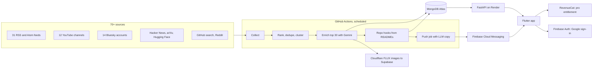

# TechiNews

**Tech news that tells you why to care, in one line.**

A GitHub repo called `hexgrad/kokoro` with the description "82M parameter open-weight TTS model" means nothing at a glance. TechiNews reads its README and shows you **"Free, open-source ElevenLabs alternative"** instead. That is the idea applied to everything: stories, repos, and the push notifications that bring you back.

It is a mobile reader for developers, founders, and investors. A collector reads 70+ sources several times a day, clusters the same story across outlets, ranks what changed, and has an LLM write the summary and the hook for the items that reach the top.

Built solo for the **RevenueCat Shipaton 2026, Next Gen category**. Flutter app, FastAPI backend, MongoDB Atlas, GitHub Actions as the scheduler. Runs at $0 a month on free tiers.

[Demo video](#) · [Devpost](#) · API: https://techinews-api.onrender.com/docs

---

## What it does

| Screen | What you get |
|---|---|
| Home | Hot-now carousel, breaking card, topic hashtags, a "From GitHub" strip, then the latest ten days. |
| Article | Headline, lede, key points, "why it matters", the story body, the linked repo, related coverage. |
| Discover | Nine topic sections, repos worth watching with README-written hooks, funding rounds with a disclosed amount. |
| Saved | Bookmarked stories, kept on the device. Ten free, unlimited with Pro. |
| Account | Interests that steer the feed, notification cadence, topic alerts, Pro. |

## The two ideas that make it different

**1. README-to-pitch hooks.** Maintainers write descriptions for other maintainers. [`repo_hook.py`](backend/app/services/ai/repo_hook.py) fetches each trending repo's README, strips badges, HTML and code blocks, and asks Gemini for a hook of at most 48 characters, a one-sentence plain pitch, and the paid product it replaces, if any. The card leads with the hook and adds a "Free alternative to X" tag only when X is a real product. One LLM call per repo, cached on the stored document.

**2. Push copy written like a friend texting.** Quick-commerce apps get far higher open rates than news apps because their pushes lead with a payoff, not a headline. [`push_copy.py`](backend/app/services/ai/push_copy.py) writes an emoji-led title under 38 characters and a one-sentence body under 90, with a hard rule that the story must deliver what the push promises. If the LLM is unavailable a deterministic template takes over, so a push never degrades to a raw headline.

## Architecture



## How the feed is built

**Sources.** RSS and Atom from publications and lab blogs, YouTube channel feeds, Bluesky's public API for posts that carry a link, the Hacker News Algolia API, GitHub search for new repos crossing a star threshold, the arXiv API, and Hugging Face papers and models. Reddit's listing pages are read through a rendering service because its JSON and RSS endpoints block datacentre traffic; registering a Reddit API app is the planned replacement. Instagram and X are not included: neither offers access without an approved developer programme.

**Ranking is deterministic and cheap.** Each item gets a source-quality base, a buzz component from hot-term hits and the engagement the source already exposes, and a freshness bonus. Buzz decays with a 36-hour half-life. The recent window is re-scored every run, so last week's big story cannot sit above this morning's decent one.

**Stories are clustered across sources.** Items within 96 hours that share a named entity or overlapping title tokens become one story. The best-scored item leads and links to the rest. No source gets more than four of the top slots.

**The LLM only touches the top thirty.** Gemini writes the summary, key points, "why it matters", tags, and a significance score for the ranked head of each run. Everything else keeps its feed summary and appears further down. This is what keeps the system inside free tiers.

**Images come from four places.** The source's own image, the page's Open Graph tag, a generated illustration from Cloudflare Workers AI for top stories, and finally one of eleven bundled category illustrations, so a card never shows a broken image.

## Monetisation with RevenueCat

Reading stays free. **TechiNews Pro** pays for the collector and the pushes.

| Free | Pro, $3.99 a month or $29 a year |
|---|---|
| Ranked feed, summaries, Discover | Everything in free |
| Daily or weekly digest push | Instant alerts, a push when a story scores 85 or higher |
| Ten saved stories | Unlimited saves |
| | Topic alerts: follow a company, a repo, or a keyword |

Why this split: the free tier has to be good enough to form a habit, and the paid tier sells time. A digest tells you tomorrow; Pro tells you now, and only about what you named.

The integration lives in [`lib/services/pro.dart`](lib/services/pro.dart):

- **One entitlement, `pro`**, checked everywhere a gate exists: the save cap, instant alerts, topic alerts, following a source.
- **Packages and prices come from the RevenueCat offering at runtime**, so pricing changes need no app release. The paywall only shows trial wording when RevenueCat reports an introductory price.
- **`Purchases.logIn` on sign-in**, so the entitlement follows the account across devices and reinstalls. Restore purchases is on the paywall.
- **Key chosen by build mode.** The Test Store key is used in debug and profile builds; release builds read a store key. The SDK deliberately stops a non-debuggable build that carries a test key, so this keeps test purchases out of anything shippable.
- The catalog (entitlement, two products, the `default` offering) was created through RevenueCat's REST API v2. **The demo runs against the RevenueCat Test Store**: as a Next Gen entry there is no store listing, so purchases are simulated by the SDK rather than billed by Google.

## Technical choices

- **Flutter + Riverpod + go_router.** One codebase, a four-tab shell, feature folders. State lives in providers; screens are thin.
- **A pop-art editorial design system.** Navy canvas, a seven-hue palette assigned per topic, Shantell Sans for headlines, DM Sans for reading, Kalam only for hand-written annotations. Phosphor icons, Simple Icons for brand marks, Open Doodles illustrations recoloured at runtime. Tokens in `lib/core/theme/`, primitives in `lib/core/widgets/`. Credits in [ASSET_CREDITS.md](ASSET_CREDITS.md).
- **Local first.** Saves, read state, interests, and notification cadence persist on the device. An account is optional.
- **FastAPI + Motor + MongoDB Atlas.** Article documents are the single source of truth. Trends, the inbox, and repo shelves are derived queries.
- **GitHub Actions as the scheduler**, with its limits designed around. The workflow is scheduled hourly, but GitHub runs scheduled jobs on a best-effort basis: measured over eleven days it ran about six times a day. So nothing depends on a run landing at an exact time. The daily digest goes out on the first run inside a morning-to-evening window and is de-duplicated per day.
- **Render free tier for the API**, which sleeps when idle. An external uptime monitor pings it every five minutes, and the app tolerates a cold start anyway with a 75-second timeout and one automatic retry.
- **Push that cleans up after itself.** Tokens FCM reports as unregistered are pruned, the app re-registers its token on every signed-in launch, and a send that reaches nobody is not recorded as sent, so it retries.

## Run it

Backend:

```bash
cd backend
python -m venv .venv && .venv/bin/pip install -r requirements.txt
cp .env.example .env          # fill MONGO_URI and GEMINI_API_KEY at minimum
.venv/bin/python scripts/run_pipeline.py --dry-run    # collect + rank, no LLM, no writes
.venv/bin/python scripts/run_pipeline.py --limit 10   # real run
.venv/bin/uvicorn app.main:app --port 8000
```

App:

```bash
flutter pub get
# .env at the repo root: API_BASE_URL=http://localhost:8000, REVENUECAT_API_KEY=<test store key>
flutter run -d chrome --web-port 3000    # web: everything except purchases
flutter run                              # Android: full experience including the paywall
```

**Demo build.** For showing the app without a purchase or a sign-in in the way:

```bash
flutter build apk --profile --dart-define=DEMO_MODE=true
```

Pro is unlocked locally, an anonymous Firebase session registers the device for
push with no sign-in screen, onboarding replays on every launch, and pushes
arriving while the app is open are drawn as an in-app banner. The flag is ANDed
with `!kReleaseMode` in [`lib/core/config/demo_mode.dart`](lib/core/config/demo_mode.dart),
so a store build ignores it and can never ship unlocked Pro.

## Repository map

```
backend/app/services/sources.py         feeds, YouTube channels, Bluesky accounts, hot-term vocabulary
backend/app/services/scrapers/          rss, github_trending, arxiv, huggingface, hackernews, bluesky, reddit, html_list
backend/app/services/ranking.py         score, dedupe, cluster, diversify
backend/app/services/pipeline.py        collect -> rank -> enrich top-N -> repo hooks -> store -> re-score
backend/app/services/ai/                summarizer, repo_hook, push_copy
backend/app/services/images.py          OG pass, GitHub cards, generation + upload
backend/app/services/notifications.py   FCM multicast, dead-token detection
backend/app/api/v1/                     articles, trends, notifications, auth, admin
backend/scripts/                        run_pipeline.py, send_pushes.py
.github/workflows/                      collect.yml (collector + pushes), keepalive.yml
lib/core/theme, lib/core/widgets        the design system and its primitives
lib/features/                           feed, article, discover, search, notifications, profile, pro, onboarding
lib/services/pro.dart                   RevenueCat integration
lib/core/network/api_client.dart        auth header, cold-start timeouts, retry
```

## Status and honest gaps

**Working:** collection from 70+ sources, ranking, clustering, summaries, repo hooks, images, the full app on a real Android 16 device, local persistence, the RevenueCat paywall and entitlement gates against the Test Store, and the scheduled collector (63 of 65 runs succeeded as of 20 Sep 2026).

**Built, not yet verified on a device:** Google sign-in on the release-signed build (it failed until the signing fingerprint was registered with Firebase; not re-tested since) and push delivery. A real digest send on 20 Sep reached no device because the only stored tokens were from old installs. Push registration happens at sign-in, so both are verified together.

**Not yet:**
- Saved stories, interests, and topic alerts live on the device and do not sync to the account.
- Topic alerts are stored and gated but the server does not yet filter pushes by them.
- No store listing, so no real billing; purchases are Test Store simulations.
- iOS is not built. There is no automated test suite worth the name.
- No users yet. This is a working prototype, not a launched product.

Planning docs: [WORK_TO_BE_DONE.md](WORK_TO_BE_DONE.md), [WORK_DONE.md](WORK_DONE.md).

## Licence and legal

[MIT](LICENSE) · [Privacy](PRIVACY.md) · [Terms](TERMS.md) · [Asset credits](ASSET_CREDITS.md)
